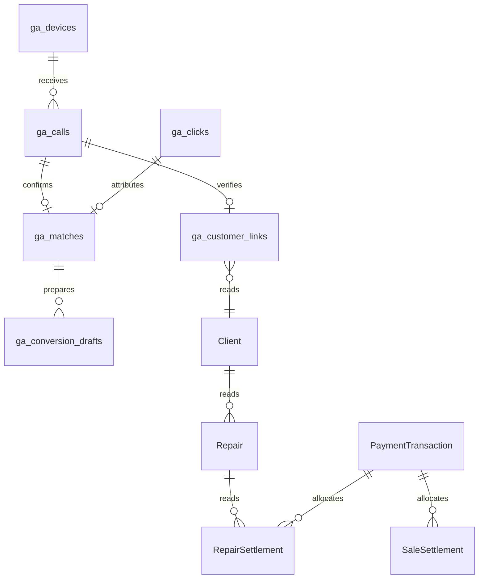

# Attribution database proposal

This proposal is review-only. Existing CRM tables remain unchanged. A separate staging database is required for migration and security testing.

The CRM diagram expresses intended relationships only. Actual foreign keys and cardinalities must be inspected before the adapter is implemented. GoogleAdsLeads is read-only lead context; it is not a payment source.

| Object | Purpose | Integrity rule |
| --- | --- | --- |
| ga_admins | Approved Supabase users | No self-enrollment policy |
| ga_settings | Persistent matching window | One row, 1–3600 seconds, default 120 |
| ga_devices | Registered call collectors | Unique token hash, revocable active flag |
| ga_calls | Normalized call history | Unique device/event pair |
| ga_clicks | Imported sheet events | Unique sheet/event source key |
| ga_candidates | Current timestamp candidates | Incoming call, prior click, inclusive window |
| ga_matches | Manual confirmations | Unique call and click; atomic validated RPC |
| ga_customer_links | Human-verified CRM identity | One customer link per call |
| ga_conversion_drafts | Actual received-payment snapshots | Unique payment transaction ID |
| ga_audit | Append-only change history | No authenticated client insert/update/delete |

## Decision rules

Zero available candidates means unmatched. One candidate means reviewable candidate. Multiple candidates mean ambiguous. Confirmation is always manual. Changing settings recalculates unconfirmed candidates; confirmed historical decisions remain recorded. A used click is excluded from other candidate sets. The unique database constraints resolve concurrent confirmation races.

Time correlation does not prove caller identity. Customer matching uses normalized phone numbers and explicit verification, and must surface duplicate CRM phones for review. A payment is eligible only after a confirmed attribution and verified customer link, and after the adapter resolves settled allocations and refunds. No amount is inferred from Repair prices.

## Access boundaries

Supabase Auth validates administrator identity. RLS restricts attribution reads to approved administrators. Settings writes and click imports have narrow admin policies. Confirmation uses a security-definer RPC that validates administrator membership and timestamps before inserting. The Android route validates a hashed device bearer token and uses the server-only service client for ingestion. Existing CRM access and RLS require a separate review; the proposed migration grants no additional access to those tables.

Supabase service credentials bypass RLS, so they are confined to the server module and never passed to client components. Deployment must add HTTPS, ingress rate limits, request streaming limits, credential rotation, monitoring and a call-data retention policy. Database grants, RLS and concurrent confirmation behavior must be tested in staging before approval for production.

## Current implementation boundary

The dashboard runs entirely on synthetic data, persisting demo decisions in browser storage. The authenticated API routes and schema are scaffolding for the next phase. Live CRM queries, a production sign-in flow, APK generation, production conversion preparation, and real database verification have not been completed or activated.
